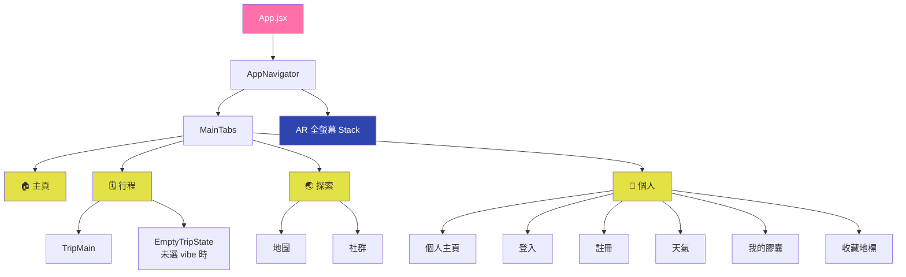
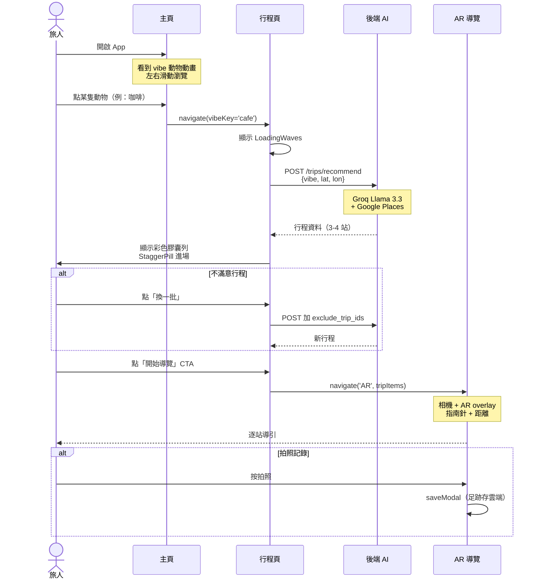
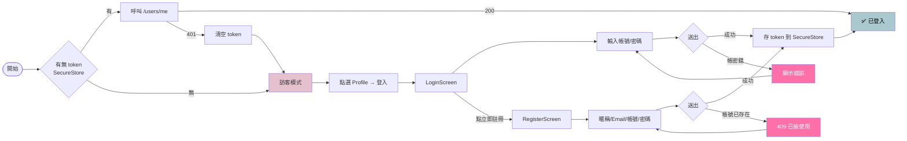
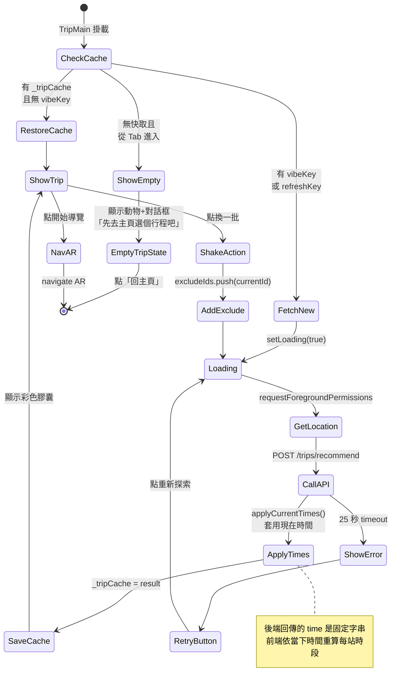
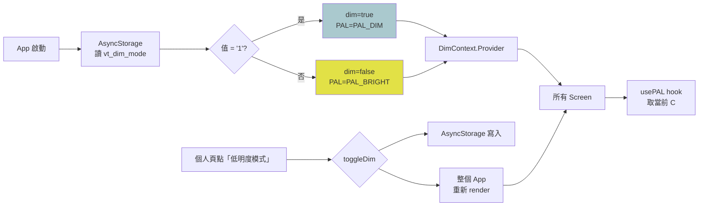
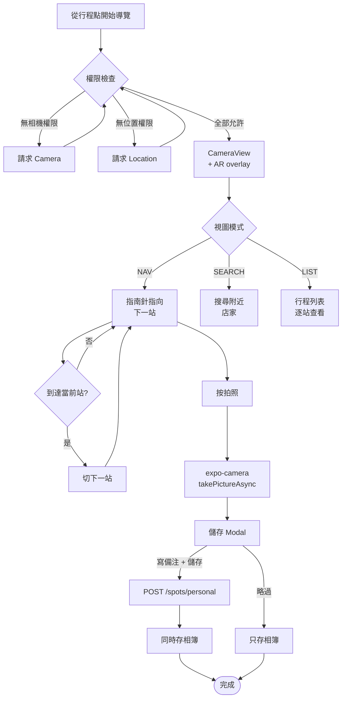
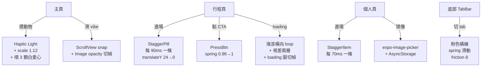
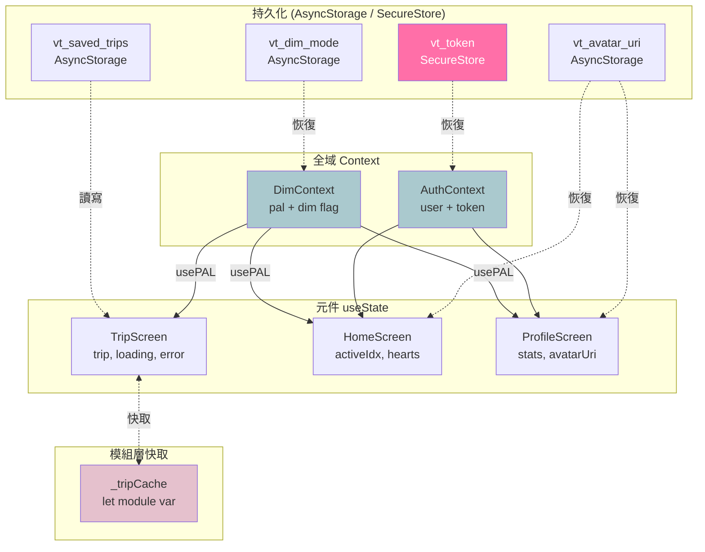
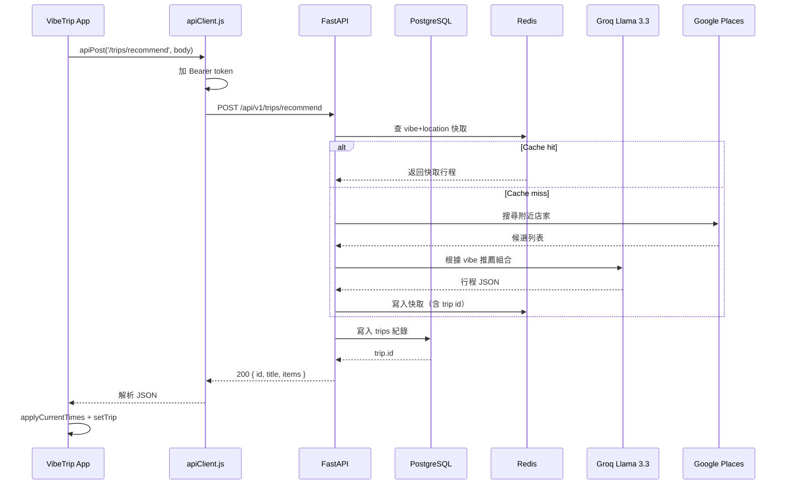

# VibeTrip — Flow Charts

> 用 mermaid 寫，在 GitHub / VS Code Mermaid Preview 都會自動渲染。

---

## 1. 整體導覽結構（Navigation Tree）

---

## 2. 使用者主要旅程（User Journey）

---

## 3. 登入 / 註冊流程

---

## 4. 行程生成內部流程

---

## 5. 低明度模式（Dim Mode）切換

---

## 6. AR 導覽動作流程

---

## 7. 互動動畫總覽

---

## 8. 資料流（State Management）

---

## 9. 全域旅程（Happy Path Story）

---

## 10. 後端 API 呼叫流程

