# VibeTrip — Flow Charts

> 用 mermaid 寫，在 GitHub / VS Code Mermaid Preview 都會自動渲染。

---

## 1. 主流程一張圖（核心黃金路徑）

> **VibeTrip 的核心體驗：選 vibe → 看行程 → AR 導覽**

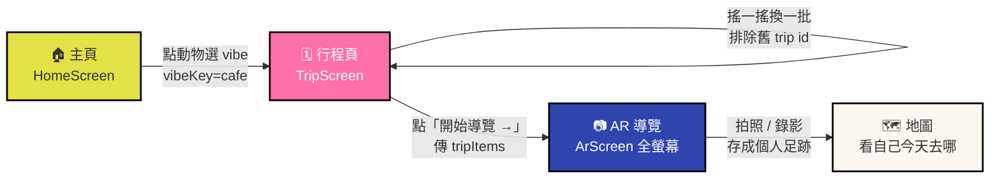

---

## 2. 整體導覽結構（Navigation Tree）

> 反映實際 Navigator 嵌套關係。AR 在頂層 Stack（全螢幕），其他 4 個都在 TabNavigator 裡。

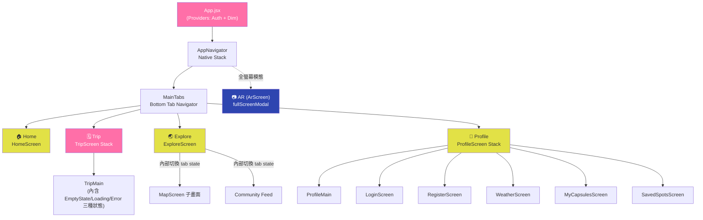

---

## 3. 使用者主要旅程（時序圖）

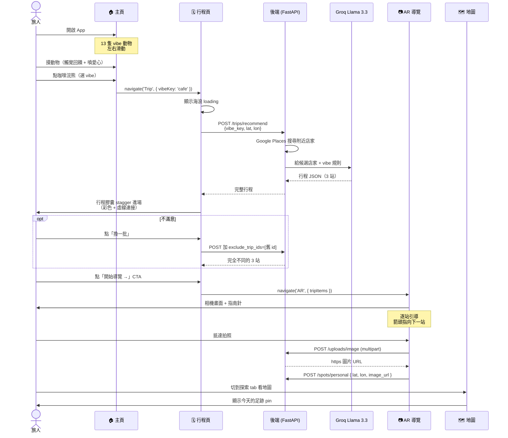

---

## 4. 行程頁三狀態切換（狀態機）

> 同一個 TripMain 元件根據 state 渲染不同畫面 — 沒選 vibe / 載入中 / 載入失敗 / 行程展示

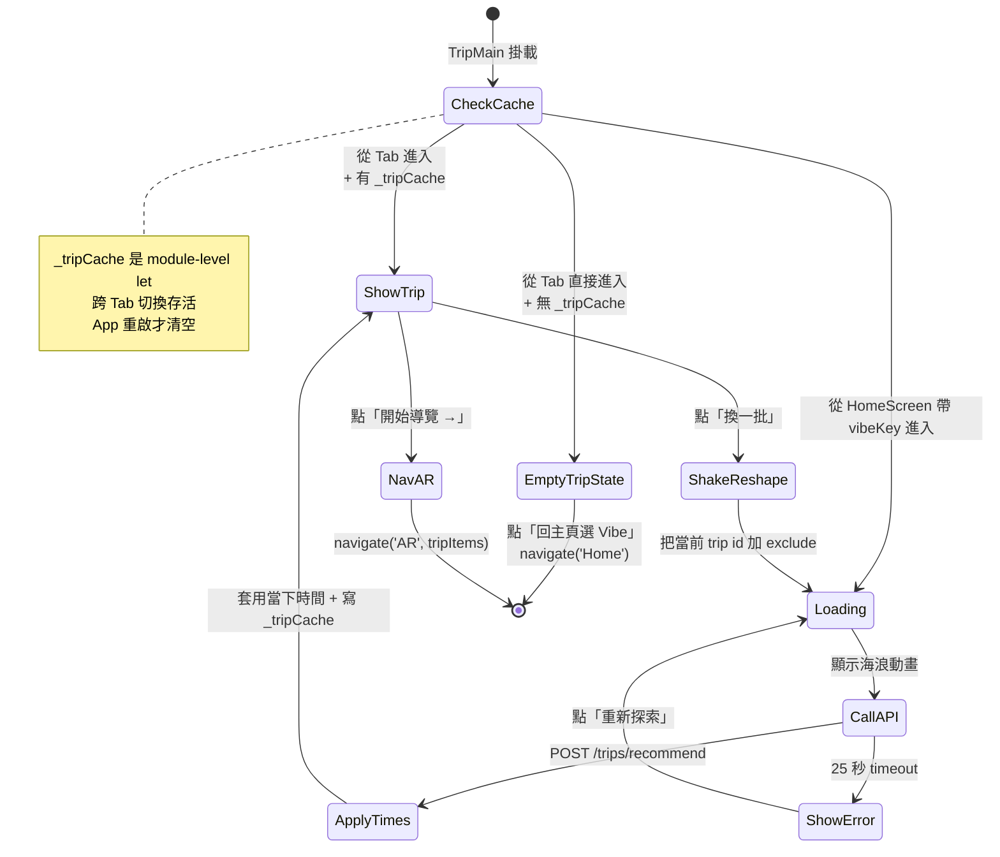

---

## 5. 登入 / 註冊流程

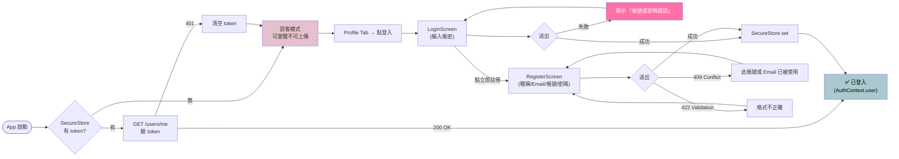

---

## 6. AR 導覽流程

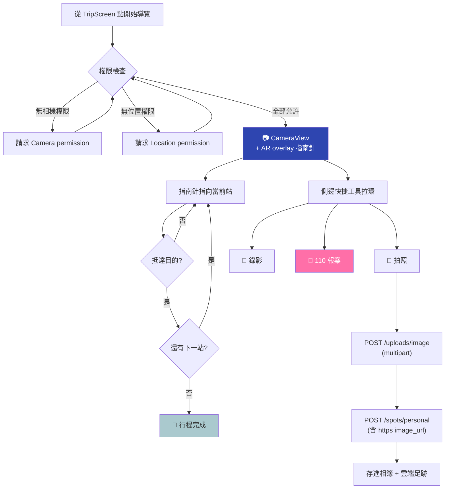

---

## 7. 低明度模式切換（DimContext）

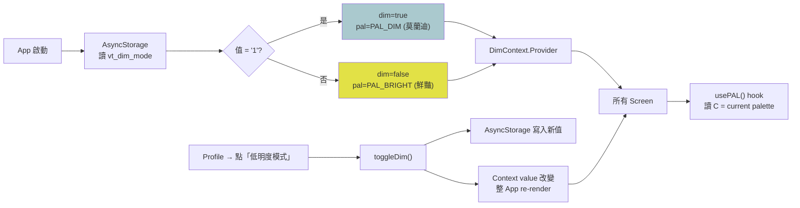

---

## 8. 全域資料流（State / Persistence）

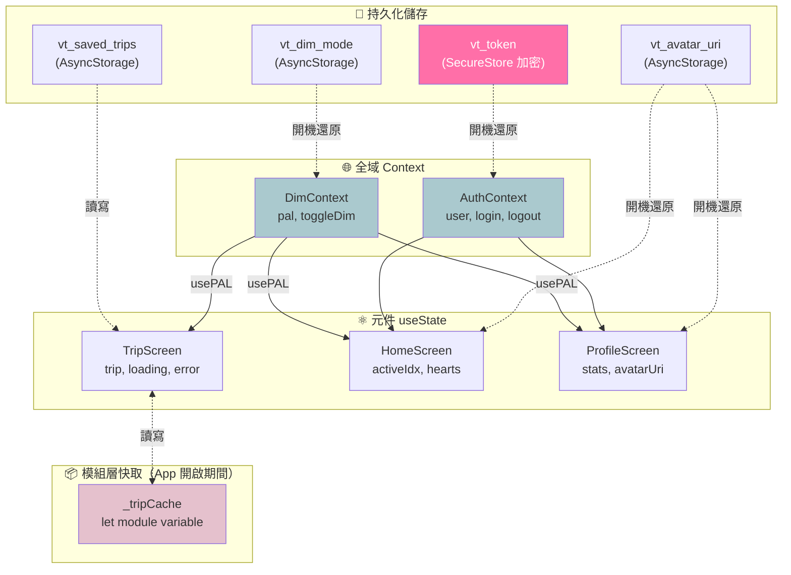

---

## 9. 後端 API 呼叫流程（以行程生成為例）

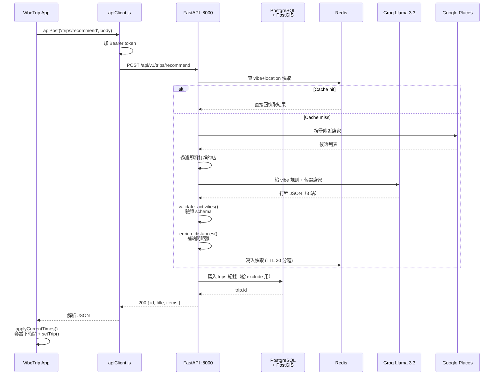

---

## 10. 圖片上傳兩階段流程

> 修過 bug 之後的正確流程：本機 file:// 先換成 https URL，再寫入 spot

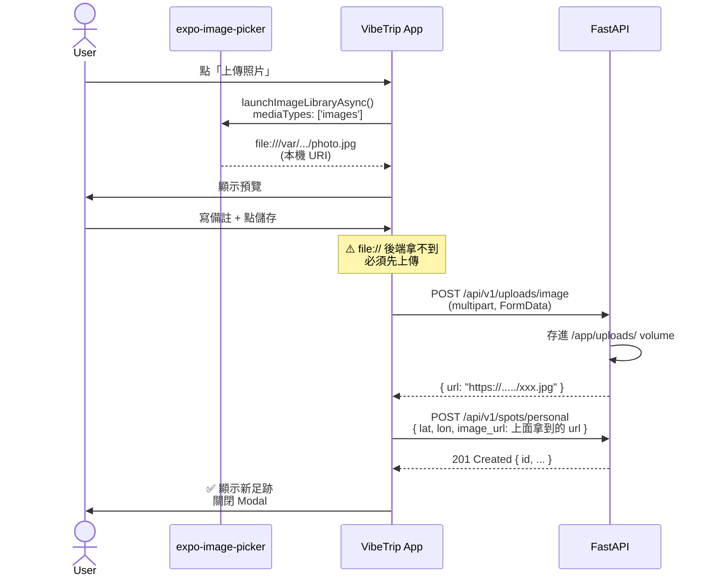

---

## 11. 全域旅程故事板

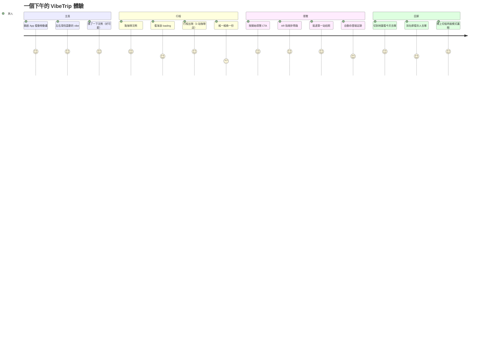
